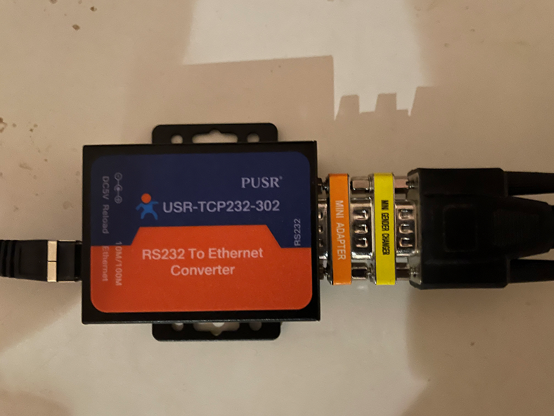
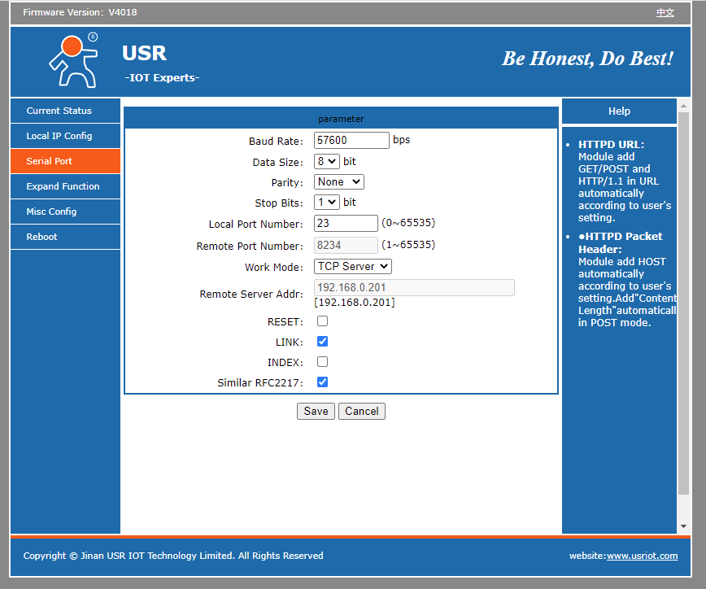

[](https://github.com/mattsaxon/HASS-SpeakercraftMediaPlayer)
# HASS-SpeakercraftMediaPlayer

Speakercraft MZC Platform for Home Assistant

Repository created for install via [HACS](https://hacs.xyz/docs/setup/download) based on code by [@sjeffrey101](https://github.com/sjeffrey101) [here](https://github.com/sjeffrey101/homeassistant_speakercraft/tree/main/old%20ha%20component/custom_components/speakercraft_media)

## Hardware set-up

Desiged to be used via direct connection (using RS232) via the MZC Control Port. (Does not currently work via the RSA-1.0 interface.)

If Home Assistant is not in proximity to SpeakerCraft MZC device then a remote serial device can be used to access the MZC remotely, see bottom of page.

MZC must be at firmware 2.2.8 (latest), if not flash it with EZ tools after downloading firmware from https://speakercraft.com/wp-content/uploads/tools/firmware_updater_03-02-11.exe

While this integration is designed to work and allow replacement of the SpeakerCraft control panels, the zones do need to be set-up via EZ-tools for the integration to function.

## Example Configuration.yaml

```
speakercraft_media:
        zones: 
          1: "Lounge Speakers"
          2: "Kitchen Speakers"
          3: "Den Speakers"
          4: "Outside Speakers"
          5: "Master Speakers"
          6: "bed1 Speakers"
          7: "bed2 Speakers"
          8: "Bathroom Speakers"
        serial_port: "/dev/serial/by-id/usb-1a86_USB2.0-Ser_-if00-port0"
        sources:
          3: "Sr3"
          4: "Sr4"
          5: "Alexa"
        default_volume: 20
        default_source: 5
        power_target: switch.speakercraft # optional parameter for when powering the amplifier or associated equipment via a smart plug
```

## Master Power
As per above config, the entity ```switch.speakercraft``` should exist which functions as the main masteroff switch.

This is intended to be used to contol a smart plug powering the amplifier. This allows it to be turned on remotely and automatically turned off when all zone are off (60 second delay implemented)

## All Off
There is a button for turning all zones off

## Party Mode
A switch is added for each zones for "Party Mode", the entity name is the name of the zone suffixed with "_party"

## Tone
There are buttons for bass/treble up/down and number sliders

## Logging

If you are having issues or want to see how the component works, you can enable logging for this integration to configuration.yaml with something similar to as follows

```
logger:
  default: warn
  logs:
    custom_components.speakercraft_media: debug
```

## Remote 
Generic remote serial devices are expected to be able to be made to work with this integration.

A confirmed workinging confiuration is documented below:

|Description   |Supplier   |Part Number   |Comment   |URL/Search Terms   |
|---|---|---|---|---|
|RS232 to Ethernet Converter|USR IOT Technology Limited  |USR-TCP232-302|Direct connection prefered as opposed to WiFi for performance|   |
|Null Modem|Tronix (eBay Seller Tronisoft)|Male-Female Serial DB9|All Null Modems should work, but be careful of gender, see below |null modem mini male female|
|Gender Changer|C2G|DB9 Male to DB9 Male Slimline Adapter|Gender changer here needed, woulkdn't be needed if Null Modem was Male/Male |db9 mini gender changer|
|MZC data cable|SpeakerCraft|?| |speakercraft mzc data cable|

Serial Port to be setup as `56700 baud, 8 bit, no partity, 1 stop bit`. Must be set-up as `TCP Server`



Serial connection string `serial_port: socket://192.168.0.7:23?logging=debug`


